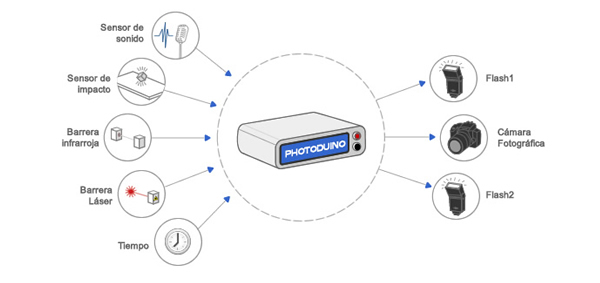

**IMPORTANTE:** Este proyecto **YA NO ESTÁ MANTENIDO POR EL AUTOR**. Todo el código fuente y los esquemas están publicados bajo licencias libres en el [repositorio de github](https://github.com/kalanda/photoduino) así que puedes usarlo, modificarlo o mejorarlo

## 

## ¿Qué es Photoduino?

Photoduino es el controlador abierto de cámaras fotográficas basado en la plataforma Arduino que puedes usar para tomar fotografías automáticamente con tu cámara DSLR o Réflex digital.

<iframe src="https://www.youtube.com/embed/jCdz2PqvwS0" 
frameborder="0" allowfullscreen class="video"></iframe>

<iframe src="https://www.youtube.com/embed/E_mhEKf3QEs" 
frameborder="0" allowfullscreen class="video"></iframe>

## ¿Qué tipo de fotografías puede tomar?

Su proposito principal es servir como apoyo técnico a la toma de fotografías de alta velocidad, pero también puedes usarlo como intervalómetro para hacer videos “Timelapse” o para la fotografía de animales o insectos. Echa un vistazo a las imágenes de ejemplo en [Flickr](http://www.flickr.com/groups/photoduino/pool/) y en [Instagram](https://www.instagram.com/explore/tags/photoduino/).

## ¿Cómo funciona?

Es un circuito electrónico que se coloca sobre una placa Arduino a modo de “shield” y toma de esta todas las entradas, salidas y pines de alimentación. Tiene todos los componentes electrónicos necesarios y dispone de conectores para conectar la cámara, los flashes y los sensores.

Puede controlar el obturador y el enfoque de la cámara y  el disparo de dos flashes. Tiene también un sensor de sonido, un sensor de impacto y una barrera laser e infrarroja que pueden ser usados para tomar las fotografías cuando se registra un evento en el sensor. Puede incluso [controlar una electroválvula](documentacion/hardware/photoduino-solenoid-valve-interface-1-0/ "Photoduino Solenoid Valve Interface 1.0") para generar directamente gotas de agua.

La configuración se realiza completamente a través de una pequeña pantalla LCD utilizando solamente dos botones, por lo que funciona de forma independiente sin la necesidad de un ordenador (salvo para las actualizaciones del firmware) pero también, puedes usar el sofware [Photoduino Remote](documentacion/software-photoduino-remote/ "Software Photoduino Remote") para controlar completamente Photoduino.

## ¿Es compatible con mi cámara?

El sistema es actualmente compatible con una amplia lista de cámaras DSLR que tienen conector para disparo remoto por cable. Revisa la [referencia de conectores](documentacion/referencia/conectores-control-remoto-de-camaras/ "Conectores control remoto de cámaras").

## Documentación

-   [Software Photoduino Remote](documentacion/software-photoduino-remote/)
-   [Hardware](documentacion/hardware/)
    -   [Photoduino Shield 1.0 y 2.0](documentacion/hardware/photoduino-shield-1-0-y-2-0/)
    -   [Photoduino Shield 3.0](documentacion/hardware/photoduino-shield-3-0/)
    -   [Photoduino Solenoid Valve Interface 1.0](documentacion/hardware/photoduino-solenoid-valve-interface-1-0/)
-   [Firmware](documentacion/firmware/)
    -   [Instalando el firmware](documentacion/firmware/instalando-el-firmware/)
    -   [Parámetros del firmware](documentacion/firmware/parametros-del-firmware/)
    -   [Navegación por los menus](documentacion/firmware/navegacion-por-los-menus/)
    -   [Configuración de sistema](documentacion/firmware/configuracion-de-sistema/)
    -   [Modo Intervalómetro](documentacion/firmware/modo-intervalometro/)
    -   [Modo disparo por sensor](documentacion/firmware/modo-disparo-por-sensor/)
-   [Referencia](documentacion/referencia/)
    -   [Conectores control remoto de cámaras](documentacion/referencia/conectores-control-remoto-de-camaras/)
    -   [Retardos de obturador de cámaras](documentacion/referencia/retardos-de-obturador-de-camaras/)
