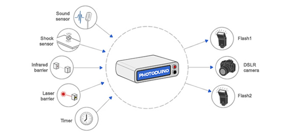

**IMPORTANT:** This project **is NOT LONGER SUPPORTED by the author**  . All code and schemas are published under opensource licences at the [github's repository](https://github.com/kalanda/photoduino) so you can to use it, modify it or improve it

## What is Photoduino?

Photoduino is the open source camera controller based on the Arduino platform which you can use to automatically take pictures with your DSLR camera.

<video controls preload="metadata" style="width:100%">
<source src="https://kalanda.github.io/photoduino/assets/videos/photoduino-intro.mp4" type="video/mp4">
<track label="English" kind="subtitles" srclang="en" src="https://kalanda.github.io/photoduino/assets/videos/photoduino-intro.vtt" default>
</video>

## What kind of pictures can take?

Its main purpose is to serve as technical support for shooting high speed photos, but you can use as intervalometer to make  ”Timelapse” videos or for animals or insects photography. Check the examples at [Flickr](http://www.flickr.com/groups/photoduino/pool/) and [Instagram](https://www.instagram.com/explore/tags/photoduino/).

## How it works?

It is an electronic circuit that is placed on an Arduino board as a “shield” taking all inputs, outputs and power pins. It has all the necessary electronic components and connectors for connecting the camera, flashes and sensors.

You can control the shutter and camera autofocus and also can triggering of two flashes. It also has a sound sensor, an shock/impact sensor and a laser or infrared barrier that can be used to take pictures when you register an event in the sensor. With the [Solenoid Valve Interface](documentation/hardware/photoduino-solenoid-valve-interface-1-0/ "Photoduino Solenoid Valve Interface 1.0") you can generate droplets directly from Photoduino.

<video controls preload="metadata" style="width:100%">
<source src="https://kalanda.github.io/photoduino/assets/videos/photoduino-ev.mp4" type="video/mp4">
</video>

The configuration is done entirely through a small LCD screen using only two buttons, so it works independently without the need for a computer (except for firmware updates) but also, you can use the [Photoduino Remote Software](documentation/photoduino-remote-software/ "Photoduino Remote Software") to wide control of Photoduino.

## Is my camera compatible?

The system currently supports a wide range of DSLR cameras with remote shutter cable connector. [Check the connectors reference.](documentation/reference/camera-remote-connectors/ "Camera remote connectors")

## Documentation

* [Photoduino Remote Software](documentation/photoduino-remote-software/)
* [Hardware](documentation/hardware/)
  * [Photoduino Shield 1.0 and 2.0](documentation/hardware/photoduino-shield-1-0-and-2-0/)
  * [Photoduino Shield 3.0](documentation/hardware/photoduino-shield-3-0/)
  * [Photoduino Solenoid Valve Interface 1.0](documentation/hardware/photoduino-solenoid-valve-interface-1-0/)
* [Firmware](documentation/firmware/)
  * [Installing the firmware](documentation/firmware/installing-the-firmware/)
  * [Firmware parameters](documentation/firmware/firmware-parameters/)
  * [Menus navigation](documentation/firmware/menus-navigation/)
  * [System config](documentation/firmware/system-config/)
  * [Intervalometer mode](documentation/firmware/intervalometer-mode/)
  * [Sensor trigger mode](documentation/firmware/sensor-trigger-mode/)
* [Reference](documentation/reference/)
  * [Camera remote connectors](documentation/reference/camera-remote-connectors/)
  * [Cameras shutterlag](documentation/reference/cameras-shutterlag/)
